

# Отчет по проекту: Мобильное приложение для записи в автосервис

## 1. Описание приложения

### 1.1. Общее описание
Данное приложение представляет собой современное решение для автоматизации процесса записи клиентов на услуги автосервиса (ремонт и техническое обслуживание). Основной целью проекта является создание удобного, интуитивно понятного интерфейса, который минимизирует временные затраты пользователя на взаимодействие с сервисом, исключая необходимость телефонных звонков и ручного согласования времени.

Проект реализован в формате кликабельного прототипа (MVP) с максимальным акцентом на пользовательский опыт (UX) и визуальный дизайн (UI), что позволяет детально продемонстрировать все основные сценарии использования системы.

### 1.2. Основные функциональные возможности
Приложение предоставляет полный набор инструментов для управления процессом обслуживания автомобиля:
- **Запись на сервис:** Пошаговый процесс выбора услуги, автомобиля, даты, времени и дополнительных параметров (бюджет, тип запчастей) с мгновенным подтверждением.
- **Управление «Гаражом»:** Возможность добавления нескольких автомобилей, хранения их технических данных (марка, модель, VIN) для автоматического подбора услуг.
- **Личный кабинет и профиль:** Управление персональными данными, просмотр истории посещений и контроль текущих статусов заявок.
- **Каталог услуг:** Структурированный список доступных работ с понятными описаниями, разделенный по категориям для быстрого поиска.

### 1.3. Целевая аудитория
В ходе исследования были выделены три ключевых сегмента пользователей, под потребности которых оптимизирован интерфейс:

1. **«Занятой профессионал» (25-45 лет):** Ценит скорость и автономность. Для этого сегмента реализована возможность записи в несколько кликов и система уведомлений.
2. **«Обычный автовладелец» (30-60 лет):** Нуждается в прозрачности и простоте. Для него разработан понятный каталог услуг без сложного технического сленга.
3. **«Автоэнтузиаст / Тюнер» (18-35 лет):** Требует контроля и детализации. Реализован выбор типов запчастей (оригинал/аналог) и детальное описание работ.

### 1.4. Концепция интерфейса и UX-цели
Визуальное решение приложения базируется на концепции **«Современный Профессионализм»**. 

**Основные характеристики дизайна:**
- **Цветовая палитра:** Использование глубокого синего цвета (`Deep Indigo Blue` #2563eb) как основного, что символизирует надежность, в сочетании с чисто светлым фоном (`Slate White` #f8fafc).
- **UX-цели:**
    - **Минимизация когнитивной нагрузки:** Использование стандартных паттернов навигации.
    - **Доступность:** Высокий контраст текста и элементов управления.
    - **Эргономика:** Расположение ключевых элементов в «зоне большого пальца».
    - **Последовательность:** Строгое соблюдение дизайн-системы (радиус скруглений 12px).

---

## 2. Ход выполнения работы

### 2.1. Этап исследования (UX Research)
На начальном этапе был проведен глубокий анализ предметной области:
- **Анализ конкурентов:** Выявлены сильные стороны современных агрегаторов и слабые места (избыточная регистрация), которые были исправлены в нашем прототипе.
- **Определение ролей:** Спроектированы функции для *Пользователя*, *Администратора* и *Лида (Мастера)*.
- **User Flow:** Построен детальный путь пользователя от входа до подтверждения записи.

### 2.2. Проектирование структуры (UX Design)
На основе исследования была разработана информационная архитектура приложения:
- **Sitemap:** Создана карта приложения, включающая **18 функциональных экранов**.
- **Вайрфрейминг:** Для каждого экрана определен перечень необходимых элементов управления.
- **Логическая схема:** Описана цепочка переходов, гарантирующая максимально короткий путь к цели.

### 2.3. Разработка дизайн-системы (UI Design)
Для обеспечения визуальной целостности была создана дизайн-система, включающая:
- **Типографику:** Шрифт `Inter` с четкой иерархией заголовков.
- **UI Kit:** Библиотека компонентов (кнопки Primary/Secondary, поля ввода с состояниями Focus/Error, карточки с мягкими тенями).

### 2.4. Техническая реализация (Prototyping)
Прототип реализован как Single Page Application (SPA) на стеке `Vite` + `React.js` + `Tailwind CSS`.

#### 2.4.1. Онбординг и Авторизация
Реализован плавный вход в приложение, начиная с экрана загрузки и заканчивая созданием аккаунта.
- **Splash Screen:** Приветственный экран с логотипом.
- **Авторизация и Регистрация:** Формы с валидацией и переходом между ними.
- **Восстановление доступа:** Поток сброса пароля.

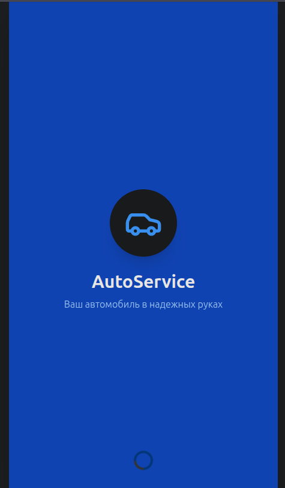
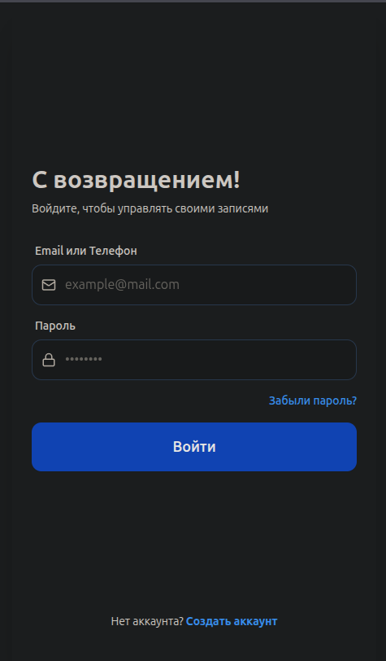
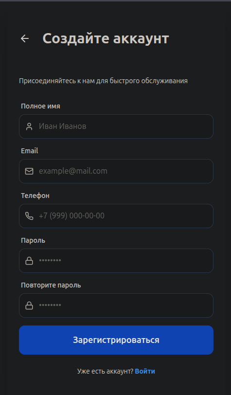
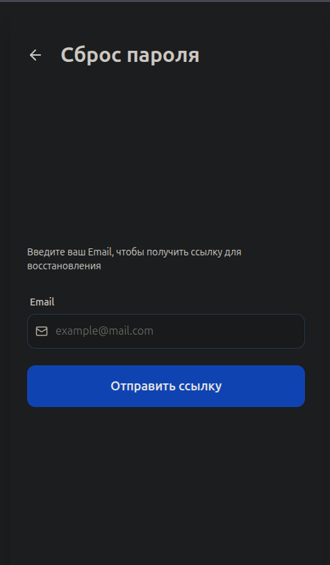

#### 2.4.2. Основная навигация и Личный кабинет
Центральный узел приложения предоставляет быстрый доступ к основным функциям.
- **Dashboard:** Главный экран с быстрыми действиями и ближайшей записью.
- **Профиль:** Управление личными данными.
- **Гараж:** Управление списком автомобилей, включая форму добавления нового авто.

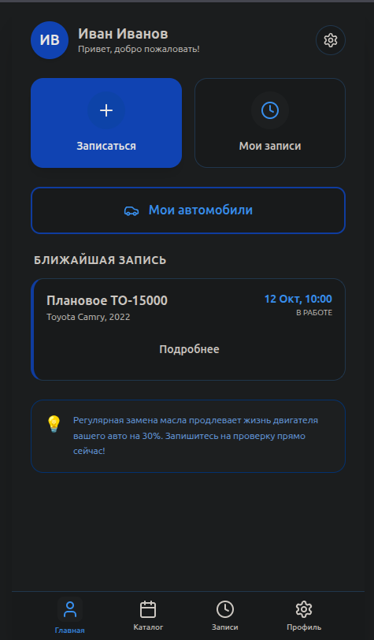
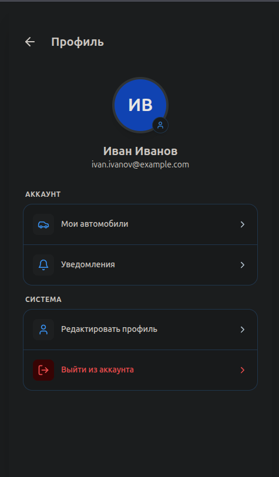
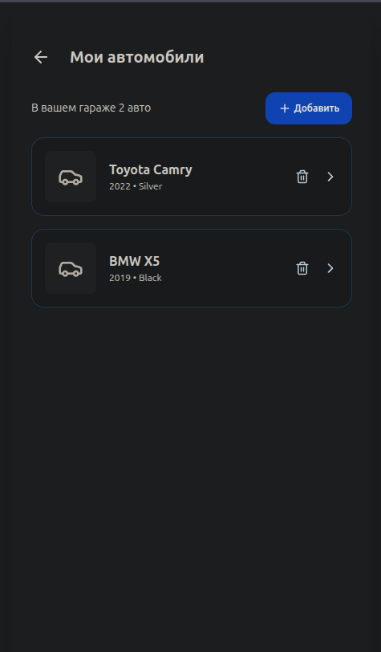
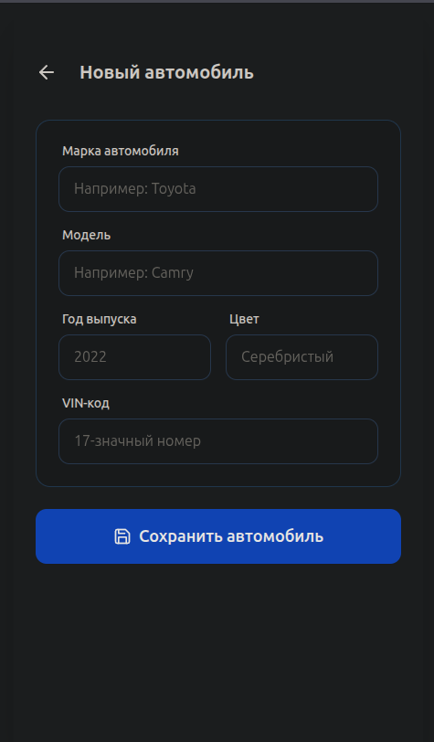

#### 2.4.3. Основной сценарий: Запись на сервис
Реализован пошаговый «золотой путь» пользователя, который минимизирует ошибки при выборе услуги.

1. **Выбор услуги:** Пользователь заходит в каталог и выбирает конкретную работу.
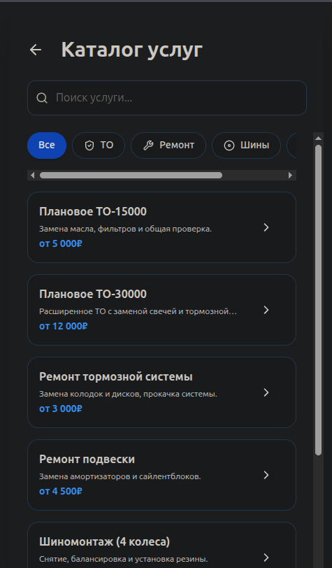
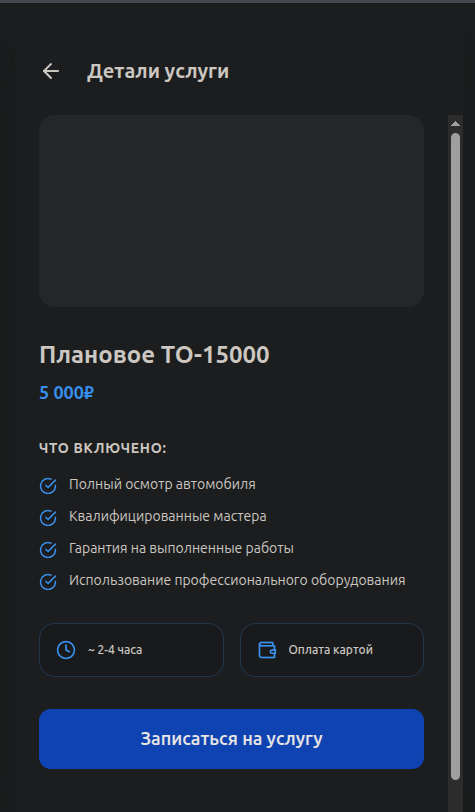

2. **Выбор автомобиля:** Привязка услуги к конкретному авто из гаража.
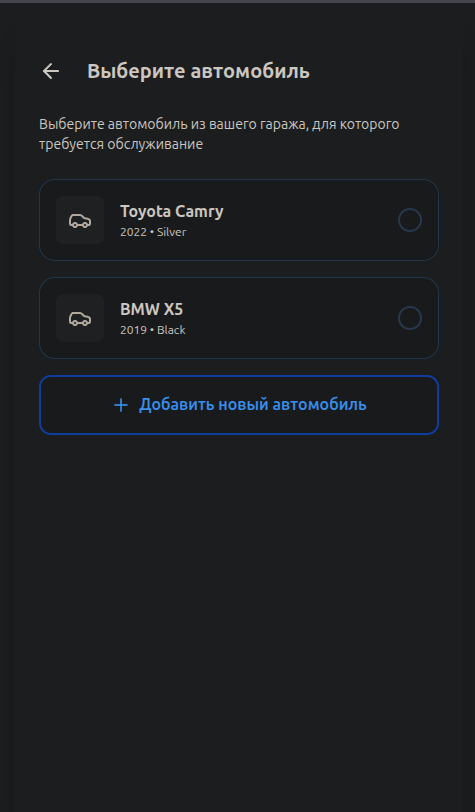

3. **Планирование визита:** Выбор подходящей даты в календаре и свободного временного слота.
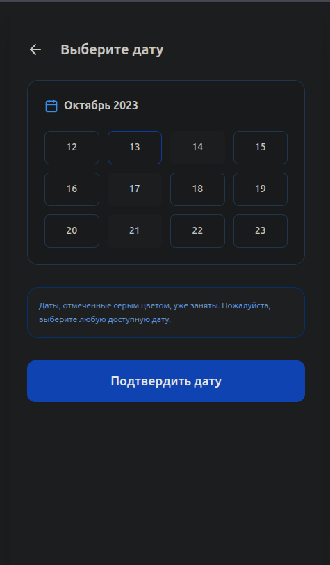
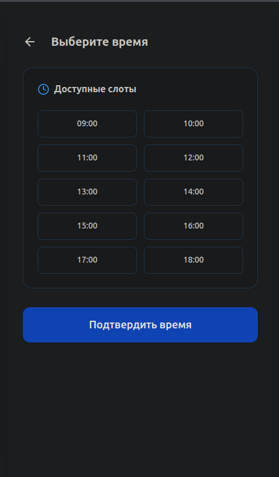

4. **Уточнение параметров:** Выбор бюджета (Эконом/Стандарт/Премиум) и типа запчастей.
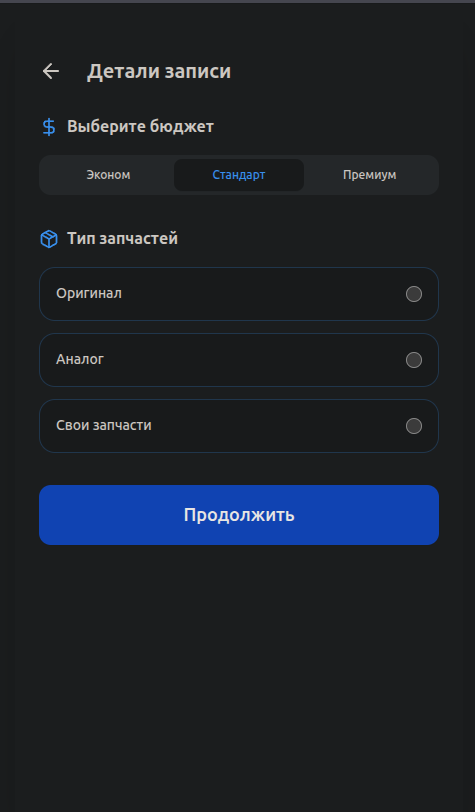

5. **Завершение:** Проверка всех данных на экране подтверждения и получение уведомления об успехе.
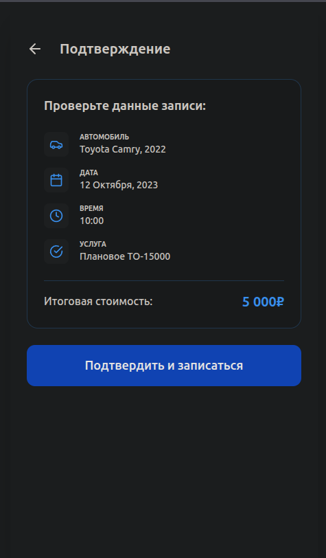
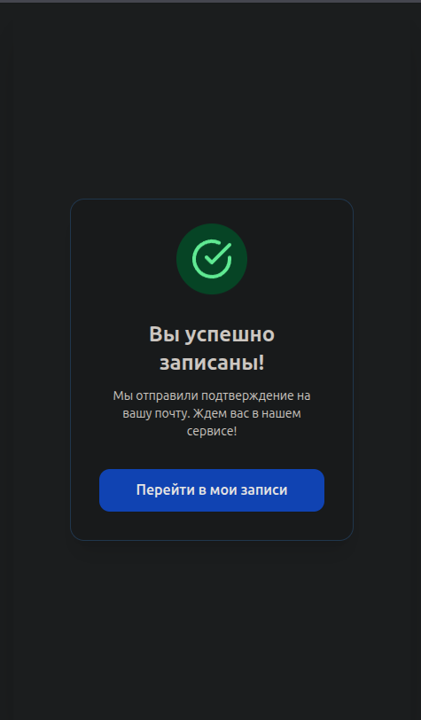

#### 2.4.4. Контроль и управление записями
Пользователь может отслеживать свои визиты и управлять ими.
- **Мои записи:** Список всех предстоящих и архивных визитов.
- **Детали записи:** Полная информация о визите с возможностью отмены или связи с мастером.

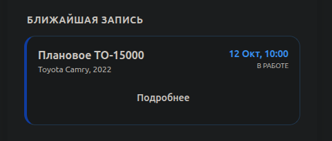
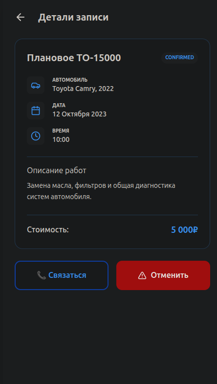

### 2.5. Тестирование и верификация
Проект прошел проверку согласно `TEST_PLAN.md`:
- **Unit-тесты:** Проверен рендеринг UI Kit.
- **Интеграционные тесты:** Все 18 маршрутов доступны, переходы работают корректно.
- **E2E-тесты:** Основной сценарий записи проходит без ошибок.

---

## 3. Сборка и развертывание

### 3.1. Структура проекта
Проект организован модульно:
- `/prototype/src/components`: Базовые UI-элементы.
- `/prototype/src/pages`: Логика 18 экранов.
- `App.jsx`: Маршрутизация через `React Router DOM`.

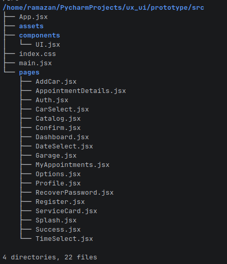

### 3.2. Процесс сборки
Используется инструмент `Vite`:
- Команда `npm run build` создает оптимизированный статический билд.
- `Tailwind CSS` обеспечивает минимальный размер CSS за счет удаления неиспользуемых стилей.

---

## ЗАКЛЮЧЕНИЕ

В процессе выполнения лабораторных и семестровой работы были изучены принципы проектирования пользовательского опыта (UX) и интерфейсов (UI), проведен анализ целевой аудитории и конкурентов. Создан полноценный кликабельный прототип мобильного приложения для записи в автосервис, состоящий из 18 экранов, с детально проработанной дизайн-системой и User Flow. Приложение реализовано с использованием современных технологий: React, Vite и Tailwind CSS.

